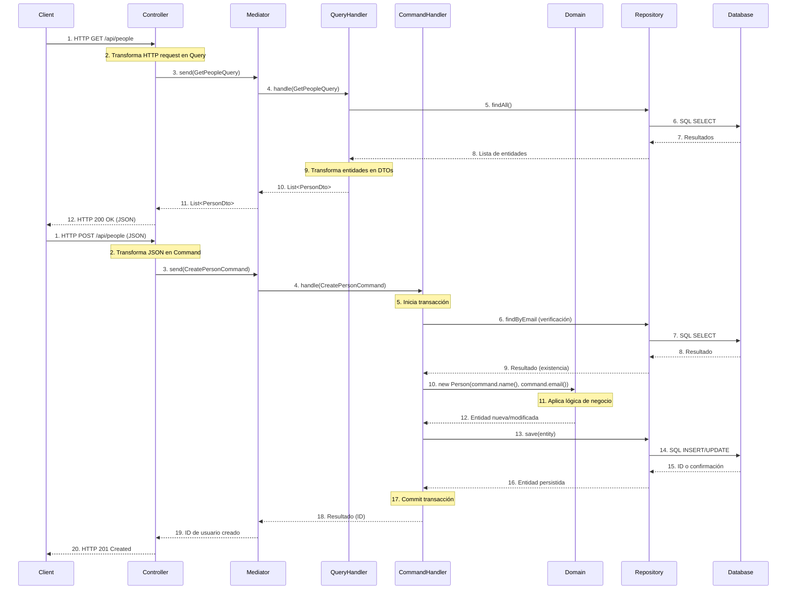

# CQRS con Spring Framework

Este proyecto implementa el patrón Command Query Responsibility Segregation (CQRS) utilizando Spring Framework. La arquitectura separa las operaciones de lectura (queries) y escritura (commands) para mejorar la escalabilidad, el rendimiento y la mantenibilidad.

## Tabla de Contenidos

- [Descripción](#descripción)
- [Arquitectura](#arquitectura)
- [Estructura del Proyecto](#estructura-del-proyecto)
- [Diagrama de Secuencia](#diagrama-de-secuencia)
- [Instalación y Ejecución](#instalación-y-ejecución)
- [Uso de la API](#uso-de-la-api)
- [Manejo de Errores](#manejo-de-errores)

## Descripción

CQRS es un patrón arquitectónico que separa las operaciones de lectura y escritura de una aplicación en modelos distintos. Este proyecto implementa CQRS junto con el patrón Mediator para desacoplar los componentes y facilitar la comunicación entre ellos.

### Principales beneficios de esta implementación:

- **Separación de responsabilidades**: Las operaciones de lectura y escritura están claramente separadas
- **Escalabilidad independiente**: Cada modelo puede escalarse de forma independiente
- **Optimización específica**: Cada modelo se optimiza para su propósito específico
- **Mantenibilidad mejorada**: Código más limpio y enfocado en una única responsabilidad

## Arquitectura

La aplicación sigue una arquitectura en capas con las siguientes responsabilidades:

- **Domain Layer**: Contiene la lógica de negocio y las entidades del dominio
- **Application Layer**: Implementa los casos de uso mediante Commands, Queries y sus respectivos Handlers
- **Infrastructure Layer**: Proporciona implementaciones técnicas como repositorios, mappers y configuraciones
- **Presentation Layer**: Maneja la interacción con los clientes a través de controladores REST

Además, se utilizan los siguientes patrones:

- **CQRS**: Separación de modelos de lectura y escritura
- **Mediator**: Enrutamiento de comandos y consultas a sus respectivos manejadores
- **Repository**: Abstracción para acceder a datos persistentes
- **DTO**: Objetos de transferencia de datos para comunicación entre capas
- **Domain Model**: Entidades ricas que encapsulan reglas de negocio

## Estructura del Proyecto

```
src/main/java/com/example/cqrs/
├── domain/
│   ├── model/
│   │   └── Person.java              # Entidad de dominio con reglas de negocio
│   ├── service/
│   │   └── PersonDomainService.java # Servicios de dominio
│   ├── exception/
│   │   └── PersonAlreadyExistsException.java # Excepciones de dominio
│   └── repository/
│       └── PersonRepository.java    # Interfaz del repositorio (puerto)
├── application/
│   ├── command/
│   │   ├── Command.java             # Interfaz marcadora para comandos
│   │   ├── CreatePersonCommand.java # Comando específico
│   │   └── handler/
│   │       ├── CommandHandler.java  # Interfaz genérica para manejadores de comandos
│   │       └── CreatePersonCommandHandler.java # Implementación de manejador
│   ├── query/
│   │   ├── Query.java               # Interfaz marcadora para consultas
│   │   ├── GetPeopleQuery.java      # Consulta específica
│   │   └── handler/
│   │       ├── QueryHandler.java    # Interfaz genérica para manejadores de consultas
│   │       └── GetPeopleQueryHandler.java # Implementación de manejador
│   ├── dto/
│   │   ├── PersonDto.java           # DTO para respuestas
│   │   └── CreatePersonRequest.java # DTO para solicitudes
│   └── mediator/
│       └── Mediator.java            # Implementación del patrón Mediator
├── infrastructure/
│   ├── config/
│   │   └── BeanConfiguration.java   # Configuración de Spring
│   ├── exception/
│   │   └── GlobalExceptionHandler.java # Manejador global de excepciones
│   └── persistence/
│       ├── entity/
│       │   └── PersonEntity.java    # Entidad JPA
│       ├── mapper/
│       │   └── PersonMapper.java    # Mapeo entre entidades de dominio y JPA
│       └── repository/
│           ├── JpaPersonRepository.java  # Repositorio Spring Data JPA
│           └── PersonRepositoryImpl.java # Implementación del repositorio de dominio
└── presentation/
    └── controller/
        └── PersonController.java    # Controlador REST
```

## Diagrama de Secuencia

El siguiente diagrama muestra los flujos de lectura (QUERY) y escritura (COMMAND) en la arquitectura CQRS:



## Instalación y Ejecución

### Prerrequisitos

- Java 21 o superior
- Maven 3.6 o superior
- PostgreSQL 17 o superior

### Configuración de la base de datos

1. Crea una base de datos en PostgreSQL:

```sql
CREATE DATABASE cqrs_demo;
```

2. Configura los datos de conexión en `application.properties`:

```properties
spring.datasource.url=jdbc:postgresql://localhost:5432/cqrs_demo
spring.datasource.username=tu_usuario
spring.datasource.password=tu_contraseña
```

### Compilación y ejecución

1. Clona el repositorio:

```bash
git clone https://github.com/tu-usuario/cqrs-spring-demo.git
cd cqrs-spring-demo
```

2. Compila el proyecto:

```bash
mvn clean package
```

3. Ejecuta la aplicación:

```bash
java -jar target/cqrs-spring-demo-0.0.1-SNAPSHOT.jar
```

O con Maven:

```bash
mvn spring-boot:run
```

## Uso de la API

### Crear una persona

```bash
curl -X POST http://localhost:8080/api/people \
  -H "Content-Type: application/json" \
  -d '{"name":"Geovanny Mendoza","email":"geovanny.mendoza@geovannycode.com"}'
```

Respuesta exitosa:

```
HTTP/1.1 201 Created
Location: http://localhost:8080/api/people/{id}
```

### Obtener todas las personas

```bash
curl -X GET http://localhost:8080/api/people
```

Respuesta:

```json
[
  {
    "id": 1,
    "name": "Geovanny Mendoza",
    "email": "geovanny.mendoza@geovannycode.com"
  },
  {
    "id": 2,
    "name": "Omar Berroteran",
    "email": "omar.berroteran@geovannycode.com"
  }
]
```

## Manejo de Errores

La aplicación implementa un manejo de errores robusto que proporciona respuestas HTTP adecuadas:

### Errores de validación (400 Bad Request)

```json
{
  "status": 400,
  "message": "Validation failed",
  "timestamp": "2025-08-03T16:45:32.123",
  "errors": {
    "email": "Invalid email format",
    "name": "Name is required"
  }
}
```

### Conflicto por duplicación (409 Conflict)

```json
{
  "status": 409,
  "message": "Person with email john.doe@example.com already exists",
  "timestamp": "2025-08-03T16:46:12.456"
}
```

### Error interno del servidor (500 Internal Server Error)

```json
{
  "status": 500,
  "message": "An unexpected error occurred. Please contact support.",
  "timestamp": "2025-08-03T16:47:01.789"
}
```

## Licencia

Este proyecto está licenciado bajo la Licencia MIT - vea el archivo [LICENSE](LICENSE) para más detalles.
